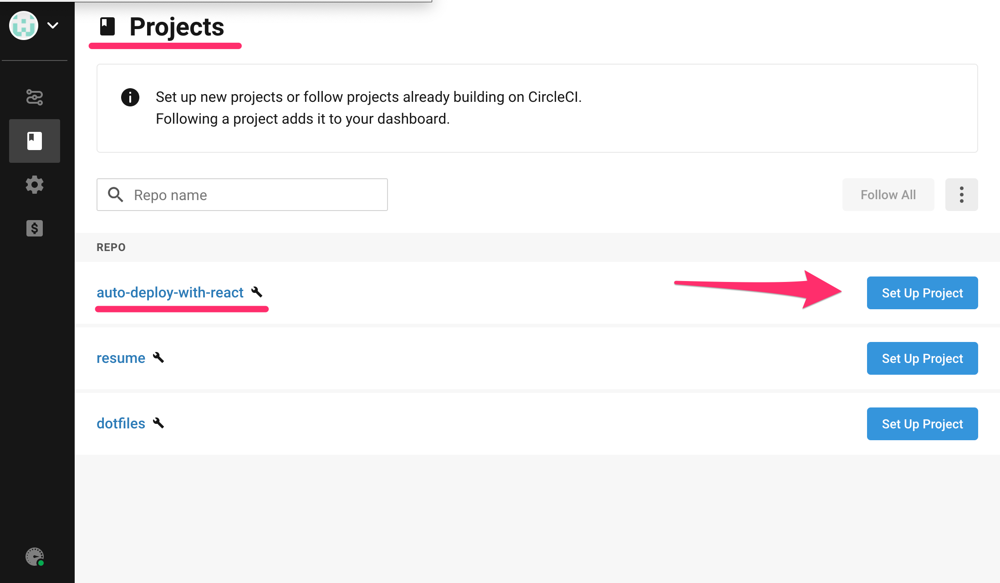
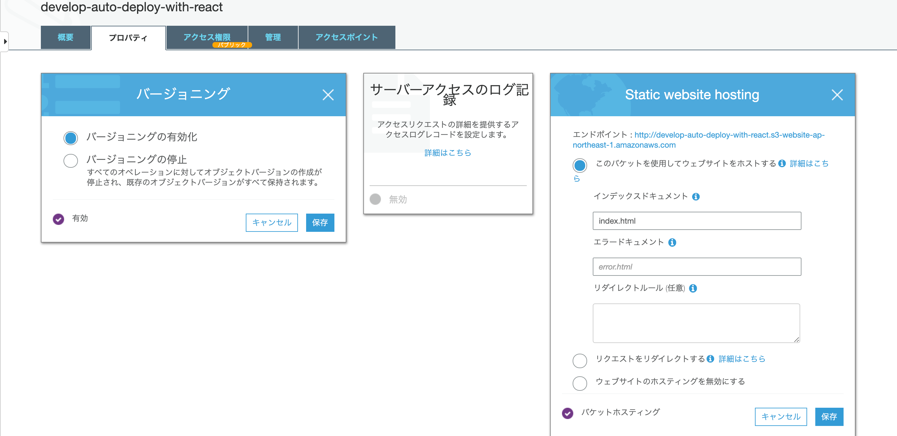

# [React](https://create-react-app.dev/) を使い運用で使われると想定する開発環境を整えていく

# 使用する技術

Nodev13.12.0
React, Redux, GitHub, CircleCI, AWS S3, Cloudfront

# 開発順

GitHub にプロジェクトを作成済の段階から始める

[1. デプロイ方法やブランチ設定](#1-デプロイ方法やブランチ設定)

[2. CI/CD の導入](#2.-CICD-の導入)

[3. デプロイ専用の AWS IAM ユーザの作成](#3.-デプロイ専用の-AWS-IAM-ユーザの作成)

[4. AWS S3 開発バケットを作成](#4.-AWS-S3-開発バケットを作成)

[5. AWS Cloudfront ディストリビューションを追加する](#5.-AWS-Cloudfront-ディストリビューションを追加する)

# 1. デプロイ方法やブランチ設定

## ブランチを複数用意

#### ステージング(デフォルトブランチ )

- `release`ブランチ
- リリースする前にリリースバージョンであったり、PRD にリリースする前に承認を得るためのブランチとする
- [doc-デフォルトブランチを設定方法](https://docs.github.com/ja/github/administering-a-repository/setting-the-default-branch)
- リリースする前に承認設定 (開発フローや Git になれてない人がいるので master ブランチへの直プッシュ保護はした方がいい) [[doc-保護されたブランチを設定する方法](https://docs.github.com/ja/github/administering-a-repository/configuring-protected-branches)]

#### 本番(PRD)

- `master`ブランチを本番専用ブランチ

### 開発からデプロイの運用の仕方

- 各開発者は個人ブランチで開発する
- 開発者は個人ブランチの内容が OK だったら release ブランチにマージする
- リリースする人は Release ブランチから master ブランチへの PR を作る。これにリリースバージョンをつけたりする
- PR をマージするとリリースワークフロー(例:CodePipeline)が起動する
- 最初は STG 環境にデプロイし動作確認する
- STG 環境が OK だったら承認して PRD へのデプロイに進む。CodePipeline の場合は「承認」というプロセスをワークフローに含めることができる。

# 2. CI/CD の導入

※ 今回は CI/CD のデプロイ手法で構築していくが、以下の観点で考える必要もある

```
## CircleCI を使う？ AWS CodePipeline を使う？
「AWS にはない CircleCI の ○○ 機能が必須」という理由が特になければ、
AWS のプロダクトで固めちゃう というのもナイスな方針な 1 つ。
コントロールする対象が増えたぶんだけ、管理コストが増えてしまう。
コントロールする対象はできるだけ増やさない というのがインフラ管理の原則の 1 つといえます。
```

[doc-CircleCI のセットアップ方法](https://circleci.com/docs/2.0/getting-started/#section=getting-started)

- `Projects`タブの CI／CD を追加したいプロジェクトの`Set Up Project`を選択

  <br>

- `Start building` をクリックし、プロジェクトに CI/CD を追加する

  <br>

file: .circleci/config.yml

```yml
version: 2.1
orbs:
  node: circleci/node@1.1.6
jobs:
  build-and-test:
    executor:
      name: node/default
    steps:
      - checkout
      - node/with-cache:
          steps:
            - run: npm install
            - run: npm test
workflows:
  build-and-test:
    jobs:
      - build-and-test
```

# 3. デプロイ専用の AWS IAM ユーザの作成

1. CI/CD から AWS にアクセスするためのユーザを作成<br>
   (アクセスキー ID・シークレットキーアクセスキーを取得する )

   ※ AWS アクセスの種類を選択 (プログラムによるアクセスをチェック )

   ※ policy を追加 (AmazonS3FullAccess, CloudFrontFullAccess) デプロイに必要な権限のみをつける

2. 取得したアクセスキー ID・シークレットキーアクセスキーを CI/CD に環境変数を登録する

- CI/CD の選択したプロジェクトの (Pipelines → Project Settings → Environment Variables)から追加
  - AWS_ACCESS_KEY_ID : アクセスキー ID
  - AWS_SECRET_ACCESS_KEY: シークレットキーアクセスキー
  - AWS_REGION: リージョン (ap-northeast-1)

# 4. AWS S3 開発バケットを作成

1. s3 バケットを追加

<br>

※ バケット名: バケット名は全世界でユニークな値<br>
※ リージョン: アジアパシフィック (東京 )

2. 作成した s3 バケットを設定する

- アクセス権限
  - パブリックアクセスをすべてブロック: オフ

<br>

- バケットポリシー: 下の policy を設定する

<br>

`add-your-bucket-name-here` は S3 で設定したバケット名に変更する

```json
{
  "Version": "2012-10-17",
  "Statement": [
    {
      "Sid": "PublicReadForGetBucketObjects",
      "Effect": "Allow",
      "Principal": "*",
      "Action": "s3:GetObject",
      "Resource": "arn:aws:s3:::add-your-bucket-name-here/*"
    }
  ]
}
```

### 余談 s3 バケットの Static Website Hosting を有効に場合<br>

※ S3 バケットへ直接アクセスを可能にする<br>
※ 本番環境では使用しない方が良い

- プロバティ
  - バージョニング：有効
  - Static website hosting
    - このバケットを使用してウェブサイトをホストする
    - インデックスドキュメント: index.html

<br>

3. s3 で設定したバケット名を CI\CD の環境変数に追加する

- AWS_DEV_BUCKET: development-app
- AWS_BUCKET_STAGING: staging-app
- AWS_BUCKET_PRODUCTION: production-app

# 5. AWS Cloudfront ディストリビューションを追加する

1. Cloudfront (作成 → ウェブ (Get Started) → 下画像を参考に作成 )<br>
   ※ 下の画像を参考にすると https の設定になるので Cloud Front のドメイン名から Web ページを開くときは注意が必要

   <br>
   <br>
   <br>

2. staging, production まで追加後は s3 バケットのバケットポリシーに以下の policy が追加されてることを確認する

   <br>

3. Cloudfront を作成後 CI/CD に変数を登録していく

- DEV_DISTRIBUTION_ID: Cloudfront Distribution ID
- STAGING_DISTRIBUTION_ID: //
- PRODUCTION_DISTRIBUTION_ID: //

  <br>

## 4. CI/CD を使いデプロイする

- [.circleci/config.yml](https://github.com/hrk-m/auto-deploy-with-react/blob/develop/.circleci/config.yml)を設定する
  - CI が通り AWS s3, CloudFront にリリースされてれば OK

#### 参考

- [ciecle CI ビルドバージョン](https://circleci.com/docs/ja/2.0/circleci-images/#nodejs)
- [CircleCI を設定ドキュメント](https://circleci.com/docs/ja/2.0/sample-config/)
- [s3 cli コマンド](https://docs.aws.amazon.com/ja_jp/cli/latest/userguide/cli-services-s3-commands.html)

```yaml
version: 2.1
executors:
  app-executor:
    docker:
      - image: circleci/node:13.12.0
    working_directory: ~/repo

aliases:
  - &show-current-branch-name
    run:
      name: Show current branch
      command: echo ${CIRCLE_BRANCH}
  - &restore-cache
    restore_cache:
      keys:
        - app-{{ checksum "package.json" }}
        - app-
  - &install-dependencies
    run:
      name: Install dependencies
      command: npm install
  - &save-cache
    save_cache:
      paths:
        - node_modules
      key: app-{{ checksum "package.json" }}
  - &install-aws-cli
    run:
      name: Installing AWS CLI
      working_directory: /
      command: |
        sudo apt-get -y -qq update
        sudo apt-get install -y awscli
        sudo apt-get install -y python-pip python-dev build-essential
  - &build-project
    run:
      name: Build Project
      command: |
        npm install
        npm run build
        cd build
        zip ../build.zip -r * .[^.]*
        echo "Build successful"
jobs:
  build:
    executor: app-executor
    steps:
      - checkout
      - *show-current-branch-name
      - *restore-cache
      - *install-dependencies
      - *save-cache

  deploy-to-aws-s3:
    executor: app-executor
    steps:
      - checkout
      - *show-current-branch-name
      - *install-aws-cli
      - *build-project
      - run:
          name: Deploy to AWS S3
          command: |
            if [ "${CIRCLE_BRANCH}" == "master" ]
            then
              aws --region ${AWS_REGION} s3 sync ~/repo/build s3://${AWS_BUCKET_PRODUCTION} --delete
            elif [ "${CIRCLE_BRANCH}" == "staging" ]
            then
              aws --region ${AWS_REGION} s3 sync ~/repo/build s3://${AWS_BUCKET_STAGING} --delete
            else
              aws --region ${AWS_REGION} s3 sync ~/repo/build s3://${AWS_DEV_BUCKET} --delete
            fi
  deploy-to-aws-cloudfront:
    executor: app-executor
    steps:
      - checkout
      - *show-current-branch-name
      - *install-aws-cli
      - *build-project
      - run:
          name: Deploy to AWS Cloudfront
          command: |
            aws configure set preview.cloudfront true
            if [ "${CIRCLE_BRANCH}" == "master" ]
            then
              aws cloudfront create-invalidation --distribution-id ${PRODUCTION_DISTRIBUTION_ID} --paths /\*
            elif [ "${CIRCLE_BRANCH}" == "staging" ]
            then
              aws cloudfront create-invalidation --distribution-id ${STAGING_DISTRIBUTION_ID} --paths /\*
            else
              aws cloudfront create-invalidation --distribution-id ${DEV_DISTRIBUTION_ID} --paths /\*
            fi
workflows:
  build_and_deploy:
    jobs:
      - build
      - deploy-to-aws-s3:
          requires:
            - build
          filters:
            branches:
              only:
                - develop
                - staging
                - master
      - deploy-to-aws-cloudfront:
          requires:
            - deploy-to-aws-s3
          filters:
            branches:
              only:
                - develop
                - staging
                - master
```
