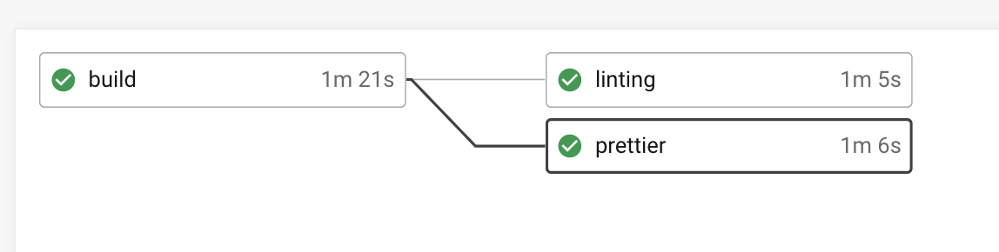

# コーディングルールとして以下のパッケージをインストールする

React, Redux

# ESLint

1. ESLint のインストール

```bash
yarn add -D eslint eslint-config-standard eslint-plugin-react eslint-plugin-node eslint-plugin-promise eslint-plugin-standard
```

- yarn add <package...> [--dev|-D] : devDependencies にパッケージ追加

[doc-yarn](https://classic.yarnpkg.com/en/docs/cli/add) ( yarn add option 設定などが記載 )

2. `.eslintrc.json` に設定ファイルを追加

file: .eslintrc.json

```json
{
  "env": {
    "browser": true,
    "es6": true,
    "jest": true
  },
  "extends": ["plugin:react/recommended", "standard"],
  "globals": {
    "Atomics": "readonly",
    "SharedArrayBuffer": "readonly"
  },
  "parserOptions": {
    "ecmaFeatures": {
      "jsx": true
    },
    "ecmaVersion": 2018,
    "sourceType": "module"
  },
  "settings": {
    "react": {
      "version": "16.0"
    }
  },
  "plugins": ["react"],
  "rules": {
    "import/no-named-default": 0,
    "semi": [2, "always"],
    "space-before-function-paren": [
      0,
      { "anonymous": "always", "named": "always" }
    ],
    "camelcase": 0,
    "no-return-assign": 0
  }
}
```

3. package.json にコマンド追加<br>
   下のように追加することにより yarn lint で `src/**/*.js*`配下のファイルのコードをチェックすることができる

```json
"scripts": {
    "lint": "eslint 'src/**/*.js*'",
    "fixlint": "eslint 'src/**/*.js*' --fix"
  }
```

---参考---

[hrk-m/react-app-auto-deploy](https://github.com/hrk-m/react-app-auto-deploy/commit/5a536f49e9c63f3d61705741ea625d841e109a5e) で CI に ESLint を追加した

[preflight check でエラーが出るケースの対応](https://github.com/facebook/create-react-app/issues/5247)

# Prettier

1.  prettierのインストール

```bash
yarn add -D prettier
```

2. .prettierrc.json ファイルを作成、prettier で設定を記載する

- 例) .prettierrc.json
```json
{
  // 複数行の場合、可能な限り末尾のコンマを出力: none
  "trailingComma": "none",
  "tabWidth": 2,
  "semi": true,
  "singleQuote": true
}
```

3. package.json にコマンド追加<br>
   下のように追加することにより yarn lint で `src/**/*.{js,jsx,json}`配下のファイルのコードをチェックすることができる

```json
"scripts": {
    "prettier:check": "prettier --check 'src/**/*.{js,jsx,json}'",
    "prettier:write": "prettier --write 'src/**/*.{js,jsx,json}'"
  }
```

※追伸
- .editorconfig もあると、エディターのコーディングスタイルも統一できる
```.editorconfig
# EditorConfig is awesome: https://EditorConfig.org
# EditorConfig helps developers define and maintain consistent
# coding styles between different editors and IDEs

root = true

[*]
charset = utf-8
# 文字コード設定（latin1/utf-8/utf-8-bom/utf-16be/utf-16le/...）
indent_style = space
# インデントスタイル: space
end_of_line = lf
# 改行コード指定: LF
trim_trailing_whitespace = true
# 行末スペースを削除: 有
insert_final_newline = true
# ファイル末尾の改行: 有
max_line_length = 200
indent_size = 2
# インデント幅: 2
tab_width = 4
# タブの幅

[*.md]
# 行末の空白を削除: しない
max_line_length = off

```

# デプロイ時にESLint とPrettier の検証を入れる

`.circleci/config.yml`の設定<br>
<br>

```yml
version: 2.1
executors:
  app-executor:
    docker:
      - image: circleci/node:13.12.0
    working_directory: ~/repo

aliases:
  - &show-current-branch-name
    run:
      name: Show current branch
      command: echo ${CIRCLE_BRANCH}
  - &restore-cache
    restore_cache:
      keys:
        - app-{{ checksum "package.json" }}
        - app-
  - &install-dependencies
    run:
      name: Install dependencies
      command: npm install
  - &save-cache
    save_cache:
      paths:
        - node_modules
      key: app-{{ checksum "package.json" }}
  - &install-aws-cli
    run:
      name: Installing AWS CLI
      working_directory: /
      command: |
        sudo apt-get -y -qq update
        sudo apt-get install -y awscli
        sudo apt-get install -y python-pip python-dev build-essential
  - &build-project
    run:
      name: Build Project
      command: |
        npm install
        npm run build
        cd build
        zip ../build.zip -r * .[^.]*
        echo "Build successful"
jobs:
  build:
    executor: app-executor
    steps:
      - checkout
      - *show-current-branch-name
      - *restore-cache
      - *install-dependencies
      - *save-cache

  linting:
    executor: app-executor
    steps:
      - checkout
      - *show-current-branch-name
      - *restore-cache
      - run:
          name: Run linting
          command: npm run lint

  prettier:
    executor: app-executor
    steps:
      - checkout
      - *show-current-branch-name
      - *restore-cache
      - run:
          name: Run prettier check
          command: npm run prettier:check

  deploy-to-aws-s3:
    executor: app-executor
    steps:
      - checkout
      - *show-current-branch-name
      - *install-aws-cli
      - *build-project
      - run:
          name: Deploy to AWS S3
          command: |
            if [ "${CIRCLE_BRANCH}" == "master" ]
            then
              aws --region ${AWS_REGION} s3 sync ~/repo/build s3://${AWS_BUCKET_PRODUCTION} --delete
            elif [ "${CIRCLE_BRANCH}" == "staging" ]
            then
              aws --region ${AWS_REGION} s3 sync ~/repo/build s3://${AWS_BUCKET_STAGING} --delete
            else
              aws --region ${AWS_REGION} s3 sync ~/repo/build s3://${AWS_DEV_BUCKET} --delete
            fi
  deploy-to-aws-cloudfront:
    executor: app-executor
    steps:
      - checkout
      - *show-current-branch-name
      - *install-aws-cli
      - *build-project
      - run:
          name: Deploy to AWS Cloudfront
          command: |
            aws configure set preview.cloudfront true
            if [ "${CIRCLE_BRANCH}" == "master" ]
            then
              aws cloudfront create-invalidation --distribution-id ${PRODUCTION_DISTRIBUTION_ID} --paths /\*
            elif [ "${CIRCLE_BRANCH}" == "staging" ]
            then
              aws cloudfront create-invalidation --distribution-id ${STAGING_DISTRIBUTION_ID} --paths /\*
            else
              aws cloudfront create-invalidation --distribution-id ${DEV_DISTRIBUTION_ID} --paths /\*
            fi
workflows:
  build_and_deploy:
    jobs:
      - build
      - linting:
          requires:
            - build
          filters:
            branches:
              only:
                - develop
                - staging
                - master
      - prettier:
          requires:
            - build
          filters:
            branches:
              only:
                - develop
                - staging
                - master
      - deploy-to-aws-s3:
          requires:
            - linting
            - prettier
          filters:
            branches:
              only:
                - develop
                - staging
                - master
      - deploy-to-aws-cloudfront:
          requires:
            - deploy-to-aws-s3
          filters:
            branches:
              only:
                - develop
                - staging
                - master
```
