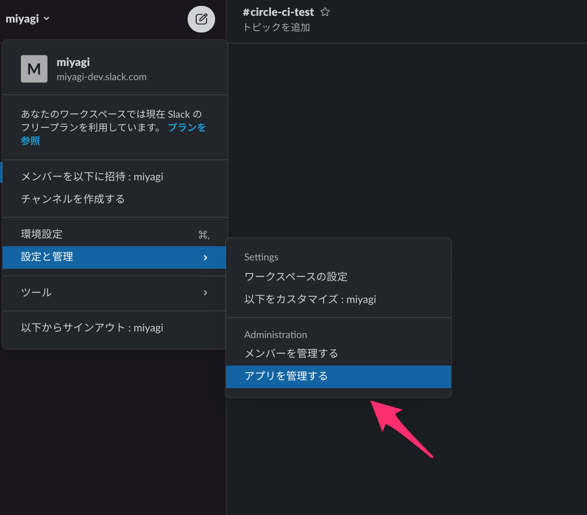
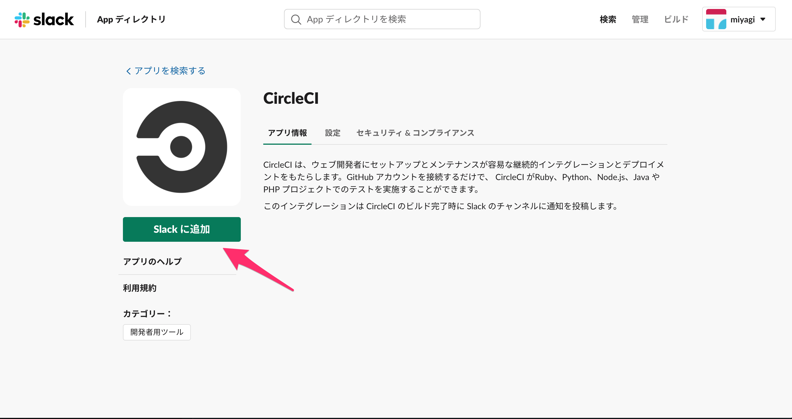
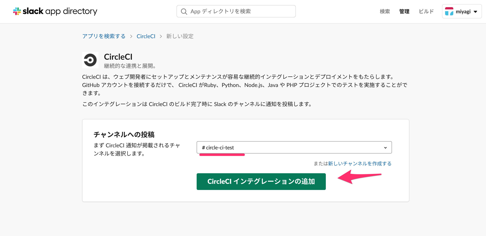
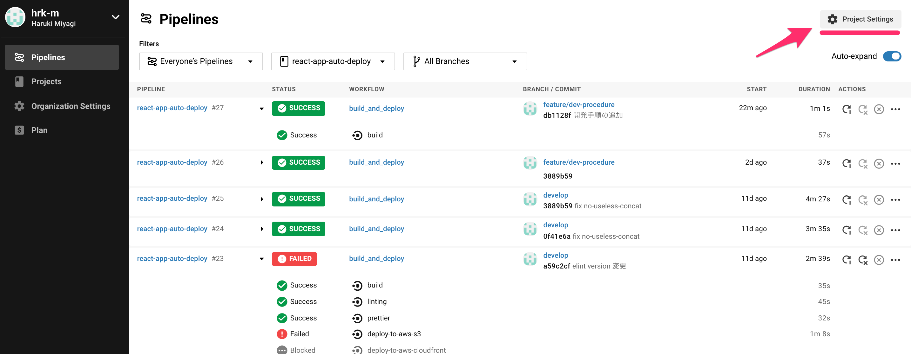
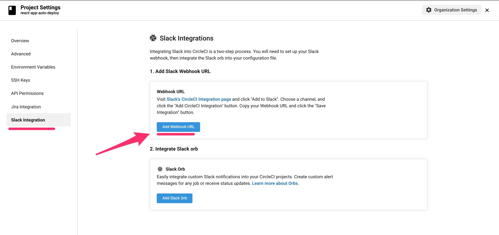
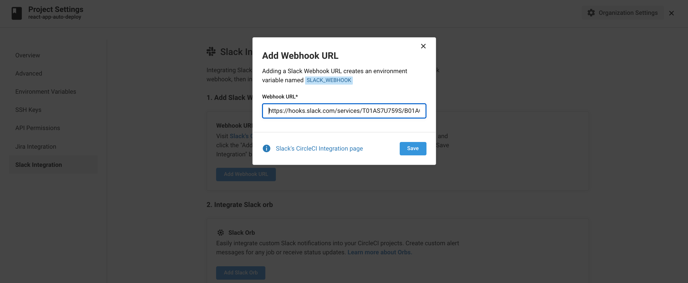
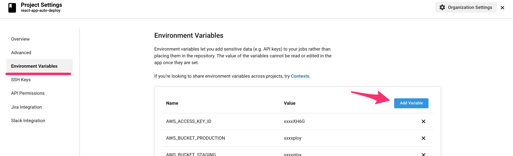
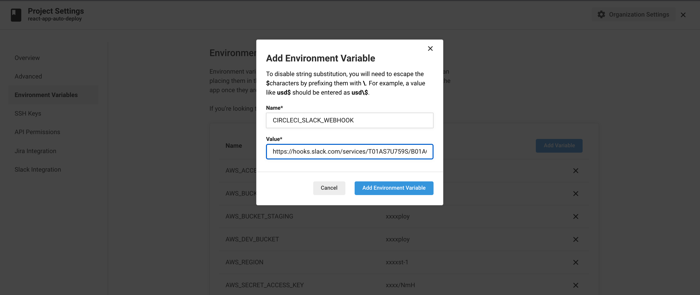

# CircleCI Orbs を使用して slack で job の結果を通知する(導入)

- 個人で試した github の差分([diff](https://github.com/hrk-m/react-app-auto-deploy/pull/5/files))
  - ユニットテスト、コードフォーマッターチェック、s3, CloudFront のデプロイが完了したら Slack に通知する
- Orbs とは: CircleCI が用意してあるパッケージを利用できるもの([公式](https://circleci.com/docs/ja/2.0/orb-intro/))

## 導入の流れ

1. Slack に通知させたいチャンネルを決める
2. webhook 取得する
3. CircleCI に webhook の url を設定する
4. `.circleci/config.yml` に通知設定をする

# 1. Slack に通知させたいチャンネルを決める

- 後ほど WEBHOOK を作成するため

# 2. webhook 取得する

- [Slack]設定と管理 → アプリ管理を選択<br>
  <br>

- 検索項目から CircleCI と検索し`Slack に追加`を選択<br>
  <br>

- 1 で決めたチャンネルを選択し `CircleCIインテグレーションの追加`を選択<br>
  <br>

- Slack に追加した後は`セットアップの手順` が表示されるのでそこで webhookurl の取得ができる

- Web Hook URL は ↓ のリンクからも追加可能
- https://slack.com/services/new/incoming-webhook
- `https://hooks.slack.com/services/xxxxxxxxxx/xxxxxxxxxx` の様な URL が取得できる

# 3. CircleCI に webhook の url を設定する

- Project settings を選択<br>
  <br>

- `Slack Integration`タブの `Add WebHook URL` を選択する<br>
  <br>

- (2)で取得した Webhook URL CircleCI に登録する<br>
- 終わったら Save ボタンを押と登録完了<br>
- CircleCI の環境変数に`SLACK_WEBHOOKという変数名` で webhook が追加されていることを確認する
  <br>

## もしくは環境変数から追加 ( 通知先を分ける時に使用すると気に使用する )

### ※ [直接追加] CircleCI の環境変数に webhook の url を設定

- `Environment Variables` → `Add Variable`<br>
  <br>

- `CIRCLECI_SLACK_WEBHOOK`の変数で WEBHOOK URL を登録する<br>
  <br>

# 4. `.circleci/config.yml` に通知設定をする

```yml
orbs:
  slack: circleci/slack@3.4.2
version: 2.1
executors:
  slack-executor:
    docker:
      - image: 'cibuilds/base:latest'
    resource_class: small

jobs:
  notify-via-slack:
    executor: slack-executor
    steps:
      - slack/notify:
          message: '${CIRCLE_BRANCH} branch deployment to aws s3 and cloudfront is complete.'
          webhook: $SLACK_WEBHOOK
      - slack/status:
          success_message: ':ok:\nBranch：$CIRCLE_BRANCH のデプロイが完了しました\n User：$CIRCLE_USERNAME'
          failure_message: ':ng:\nBranch：$CIRCLE_BRANCH のデプロイが失敗しました\n User：$CIRCLE_USERNAME'
          webhook: $SLACK_WEBHOOK

workflows:
  build_and_deploy:
    jobs:
      - notify-via-slack:
          filters:
            branches:
              only:
                - develop
                - staging
                - master
```
